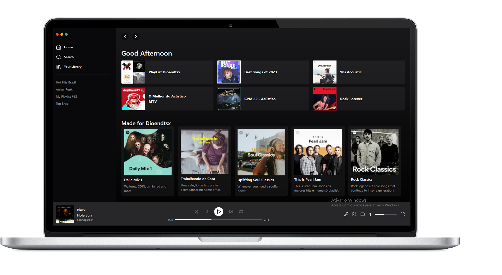

<h1 align="center">Tailwind Spotify</h1>
<!-- <h1 align="center"> NLW 07º HEAT</h1> -->

<p align="center">
    
    
    
</p>



## Tecnologias Utilizadas no projeto :construction:

- [Next](https://nextjs.org/docs/api-reference/next/image) 

- [Typescript](https://www.typescriptlang.org/) 

- [Tailwindcss](https://tailwindcss.com/docs/installation) 


- [Lucide dev](https://lucide.dev/)
<!-- 

- [Apollo Client Graphql](https://www.apollographql.com/docs/react/get-started) 


- [Date fns](https://date-fns.org/)

- [Vime](https://vimejs.com/) -->

<!-- 
- [Webpack](https://webpack.js.org/) 

- [Cross env](https://www.npmjs.com/package/cross-env)

- [ Sass ](https://sass-lang.com/) -->


## Projeto :computer:
Projeto . Desenvolver...

## Como o projeto foi criado 

> - Next
>
> ``` npx create-next-app@latest --use-pnpm name-projoct ```

## Como executar :gear:

- Clone o repositório `https://github.com/DioenDJS/Spotufy-Tailwind.git`.
<!-- - Install as dependências com o comando `npm install`. -->
<!-- - Rode o docker  `docker-compose up` para subir a imagem do postgres. -->
- Rode o projeto `npm run dev` para iniciar a aplicação.
- Ao final a aplicação estará disponível em `http://localhost:3000`.

## Dependências do Projetos :card_index_dividers:

> - Lucide dev
>
>``` npm install lucide-react ```
>

<!-- 
>``` yarn add style-loader css-loader -D ```

>
>``` yarn add cross-env -D ```

> - Sass
>
>``` yarn add node-sass -D ```
>
>``` yarn add sass-loader -D ``` -->